<center>

# Proyecto Individual Nº1


# *Machine Learning Operations (MLOps)*


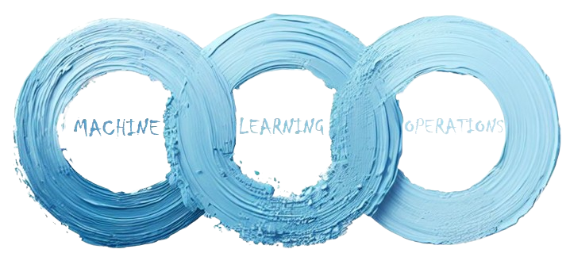

## Introduccion:
</center>

En este trabajo nos pondremos en el roll de un Data Scientist que trabaja para la plataforma de juegos multinacional Steam. Esta empresa nos encarga un sistema de recomendación de videojuegos para usuarios, junto con algunas funciones que luego desplegaremos en una API para su consumo.

Para lograr estos objetivos hemos dividido el trabajo en tres etapas; Extraccion Transformacion y Carga de datos (ETL) junto con un Analisis Exploratorio (EDA) de los mismos; Luego pasamos a desarrollar las funciones y un modelo de Machile Learning que sirva como sistema de recomendación; Como ultimo paso haremos el Deploy de nuestro trabajo a través de una API.

<center> 

## Descripcion:
</center>

En la primera etapa nos encargamos de la Carga, Exploracion y Transformacion de los datos brindados  [Jsons](Jsons), estos pasos se encuentran detallados y desarrollados en el archivo [Eda_Etl](Eda_Etl.ipynb). En esta etapa nos enfocaremos en la recolección y limpieza de nuestros tres conjuntos de datos; rellenando nulos; creando columnas nuevas; quitando duplicados y columnas innecesarias. 

A continuacion se muestran los DataSets brindados, y las columnas de interes que fueron tratadas:

- output_steam_games: Contiene informacion de los juegos que se encuentran en la plataforma. De este dataframe utilizaremos las columnas:
    * 'genres':     Contiene los generos de los juegos.
    * 'app_name':   Contiene el nombre del juego.
    * 'id':         Contiene el id interno del juego.
    * 'developer':  Contiene los desarrolladores del juego.
    * 'año_lanzamiento': Columna creada a partir del campo 'release_date', contiene el año de lanzamiento del juego.

- australian_user_items: Contiene los items de cada jugador e informacion pertinente a esta. De este dataframe utilizaremos las columnas:
    * 'item_id':     Contiene el id del juego del usuario.
    * 'user_id':     Contiene el id del usuario.
    * 'item_name':   Contiene el nombre del juego.
    * 'items_count': Contiene la cantidad de juegos que posee el usuario.
    * 'playtime_forever': Contiene el total de horas del usuario en el juego.

- australian_users_reviews: Contiene el analisis que cada jugador realizó e informacion pertinente a esta. De este dataframe utilizaremos las columnas:
    * 'año':        Creada a partir del campo 'posted', contiene el año en el que se hizo el analisis.
    * 'item_id':    Contiene el id del juego que analizó.
    * 'user_id':    Contiene el id del usuario que realizó el analisis.
    * 'recommend':  Contiene un booleano que indica si el usuario recomienda este juego.
    * 'sentiment_analysis': Columna creada a apartir del campo 'review' esta contiene el resultado de un analisis de sentimiento sobre 'review', contiene 0 - para un comentario negativo; 1 - para uno neutral; 2 - para uno positivo.

Una vez tenemos los datos listos para el trabajo procedemos al desarrollo del modelo de ML y las funciones. Para que nuestra API facilitara de forma eficiente y veloz los datos que hemos tratado, esta se alimentará de datasets personalizados que contienen los datos pre-procesados [Consultas](Consultas). Por lo tanto, nuestras funciones solo deben leer los datos de entrada y arrojar las respuestas guardadas en los datasets de Consulta.

El desarrollo de estos datasets personalizados se encuentran en el archivo [Consultas](Consultas.ipynb) explicando paso a paso el proceso que se utilizó. De esta manera nuestras funciones devolverán datos como: año con más horas jugadas por género, usuario con más horas jugadas por género, top 3 de juegos MÁS recomendados por usuarios para el año dado, etc. [Funciones](#funciones-a-implementar)

La última función desarrollada es el sistema de recomendación, la cual consta de un algoritmo de aprendizaje automático no supervisado que tiene como finalidad recomendar 5 juegos similares al juego de entrada, utilizando técnicas de recomendación con la biblioteca "sklearn.neighbors". Este modelo está desarrollado al final del archivo [Consultas](Consultas.ipynb).

Como último paso utilizamos la libreria FastApi para desplegar nuestra API en la web con la ayuda de Render (sitio que permite crear y ejecutar aplicaciones y sitios web desde Git) y GitHub (forja para alojar proyectos). El resultado de despliegue se encuentra en: https://api-w0bc.onrender.com/docs#/

Al final del documento encontrará una sección que detalla los pasos necesarios para replicar este proyecto, no obstante, se facilita un video explicativo que resume los pasos del proyecto y ayuda a la reproducción del mismo [Replica](#replica).

<center> 

# Funciones a implementar:
</center>

**Funciones**

+ def **PlayTimeGenre( *`genero` : str* )**:
    Debe devolver `año` con mas horas jugadas para dicho género.


+ def **UserForGenre( *`genero` : str* )**:
    Debe devolver el usuario que acumula más horas jugadas para el género dado y una lista de la acumulación de horas jugadas por año.


+ def **UsersRecommend( *`año` : int* )**:
   Devuelve el top 3 de juegos MÁS recomendados por usuarios para el año dado. (reviews.recommend = True y comentarios positivos/neutrales)


+ def **UsersWorstDeveloper( *`año` : int* )**:
   Devuelve el top 3 de desarrolladoras con juegos MENOS recomendados por usuarios para el año dado. (reviews.recommend = False y comentarios negativos)


+ def **sentiment_analysis( *`empresa desarrolladora` : str* )**:
    Según la empresa desarrolladora, se devuelve un diccionario con el nombre de la desarrolladora como llave y una lista con la cantidad total 
    de registros de reseñas de usuarios que se encuentren categorizados con un análisis de sentimiento como valor. 

**Sistema de recomendación item-item:**
+ def **recomendacion_juego( *`id de producto`* )**:
    Ingresando el id de producto, deberíamos recibir una lista con 5 juegos recomendados similares al ingresado.


<center> 

# Replica:
</center>

Para replicar el proyecto debemos bajar el contenido de este repositorio, luego crearemos una carpeta que contendrá los archivos necesarios para realizar el despliegue de nuestra api:

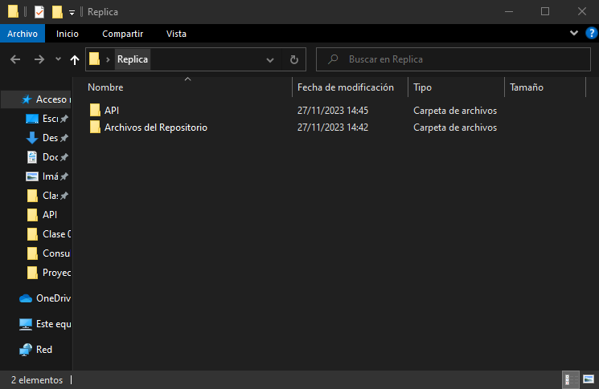

Una vez dentro de la carpeta creada, si escribimos "cmd" en la barra de direcciones. Esto abrirá una terminal en esa ubicación:

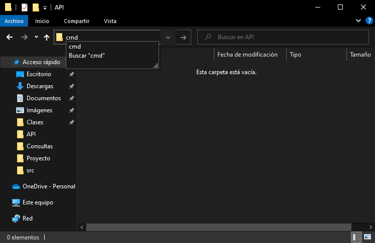
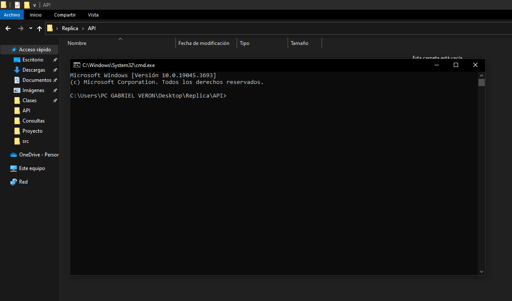

Dentro de la terminal copiamos el siguiente comando:

    python -m venv entorno_virtual

El cual creará un entorno virtual con el interprete de python dentro de una carpeta llamada "entorno_virtual". *Mantenga abierta esta terminal*


Utilizaremos este entorno virtual para correr los codigos que preparan nuestros datos.

Para ello debemos instalar las librerias que necesarias, estas se encuentran en el archivo de texto 'specs.txt'. Por lo tanto copiamos este archivo de tenxto dento de la carpeta que contiene al entorno virtual:

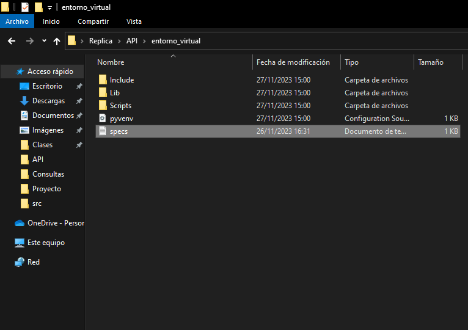

Para instalar estas librerias dentro de nuestro entorno virtual, primero debemos activar el entorno virtual, para ello corremos el siguiente comando en la terminal que teniamos abierta:

    entorno_virtual\Scripts\activate

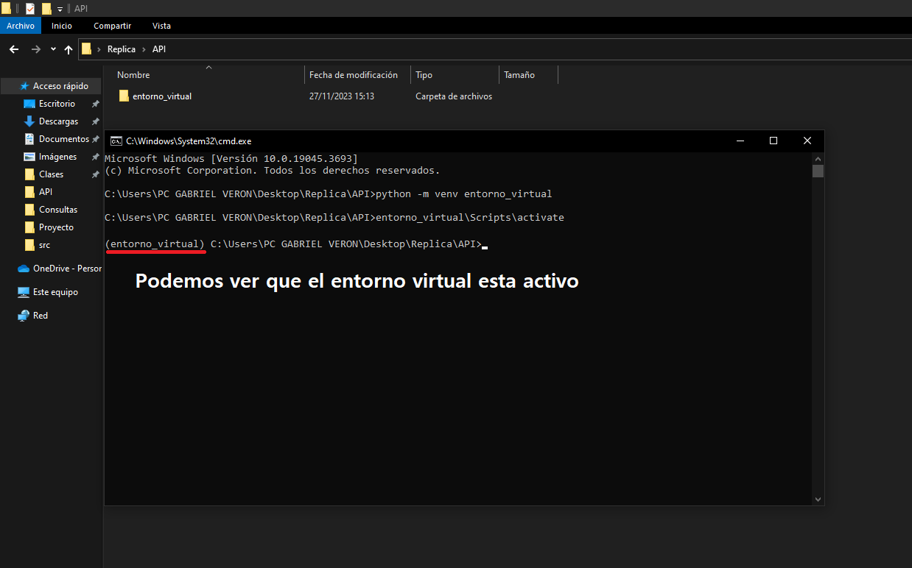

Con el entorno activo instalaremos en él las librerias necesarias con el siguiente comando:

    pip install -r entorno_virtual\specs.txt

### Al finalizar la instalacion de las librerias nuestra terminal debería verse asi:

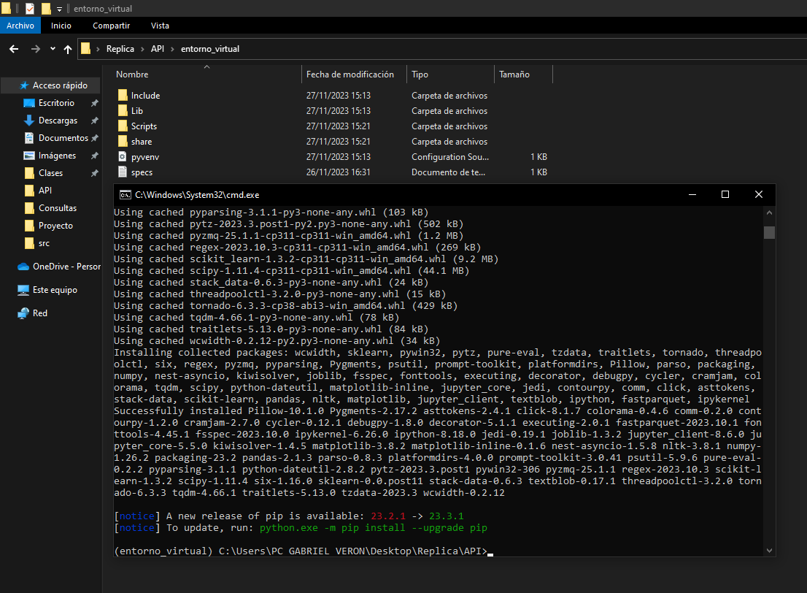

Con esto nuestro entorno está listo para tratar nuestros datos. Estos se encuentran compresos en la carpeta Json del repositorio. Entonces copiamos la carpeta de Json dentro del entorno_virtual y descomprimimos los archivos.

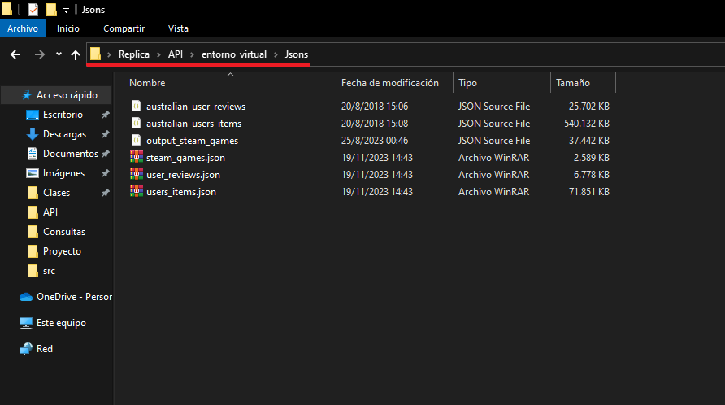

Ahora que tenemos nuestros datos, debemos copiar dentro del entorno_virtual los archivos encargados de tratarlos, estos son Eda_Etl.ipynb y Consultas.ipynb


Una vez ejecutados ambos archivos, estos nos devolverán dos carpetas: "DataSet_Limpio" contiene los tres dataset iniciales tratados y "Consultas" contiene los datos pre-procesados que consumirá nuestra API.

Con este trabajo terminado procedemos a cerrar el entorno virtual con el siguiente comando:

    deactivate

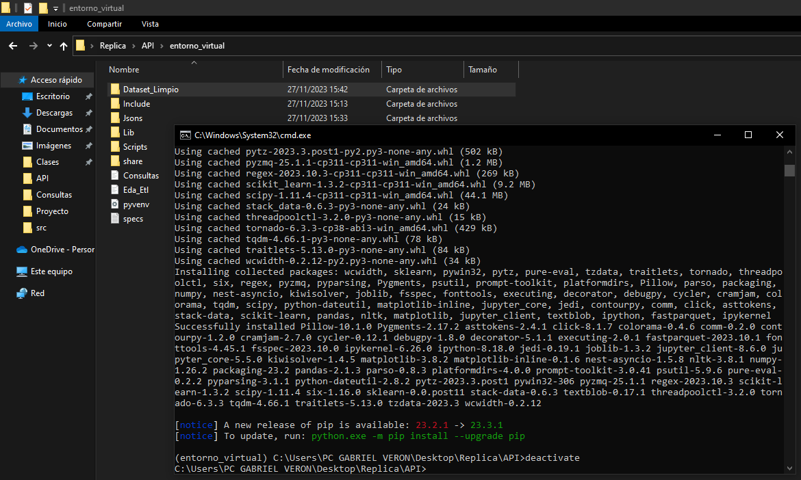

Ahora agregaremos los archivos necesarios para desplegar nuestra API. Estos son:
* .gitignore: en él se encontrarán el nombre de los archivos que no queremos subir a Github. (No subiremos el entorno virtual completo, solo lo que necesitamos para el deploy).
* funciones: se encarga de buscar las respuestas de las entradas que brinda nuestro usuario.
* main: es el archivo que se utiliza para correr la api.
* requirements: en él se encuentran los requisitos que necesita la API para correr adecuadamente.


Utilizaremos [Render](https://render.com/) para desplegar nuestra API, para eso debemos subir estos archivos a [GitHub](https://github.com/).

PASOS:
1) Crear un repositorio publico:
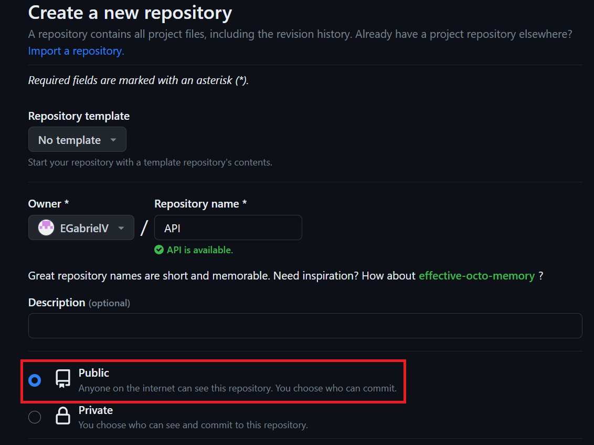

2) Usamos esta lista de comandos en GitBash, para subir estos datos a Github:

```bash
git init
git add .
git commit -m "first commit"
git branch -M main
git remote add origin -URL_DE_TU_REPOSITORIO-
git push -u origin main

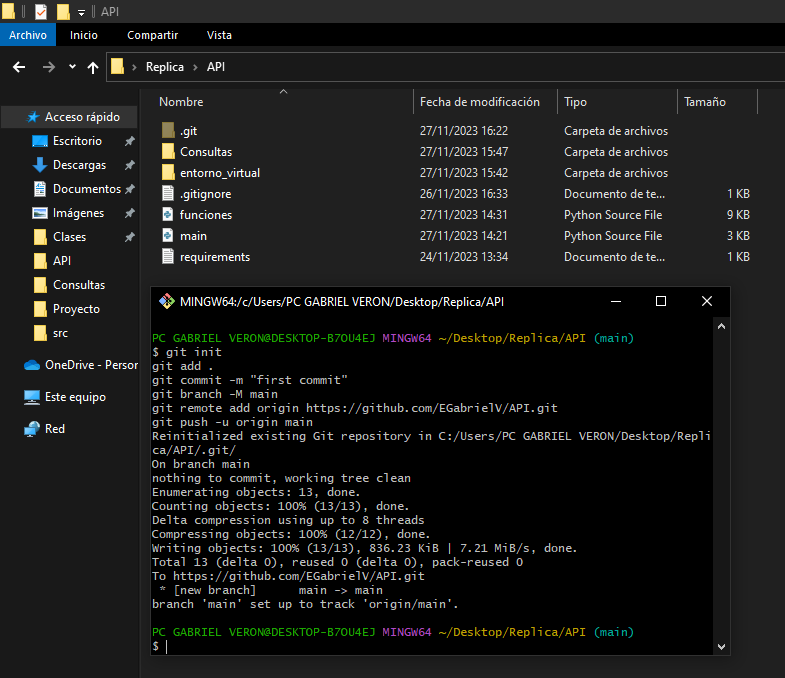

```
3) Dentro de [Render](https://render.com/) Creamos un nuevo servicio web. Alli pondremos la URL de nuestro repositorio:

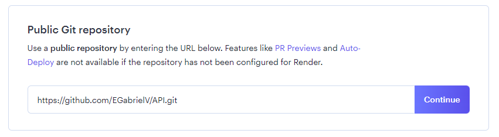

En este campo ponemos:

    uvicorn main:app --host 0.0.0.0 --port 10000

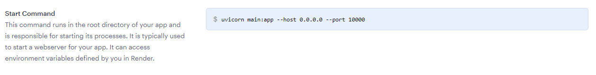

Y corremos nuestro servicio, y podemos acceder a él con el link.

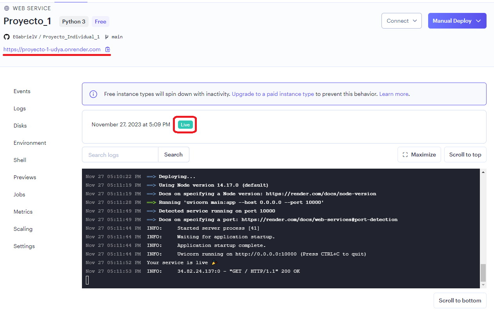

Con nuestro servicio corriendo podemos ingresar a las funciones añadiendo \docs al final de nuestro link.

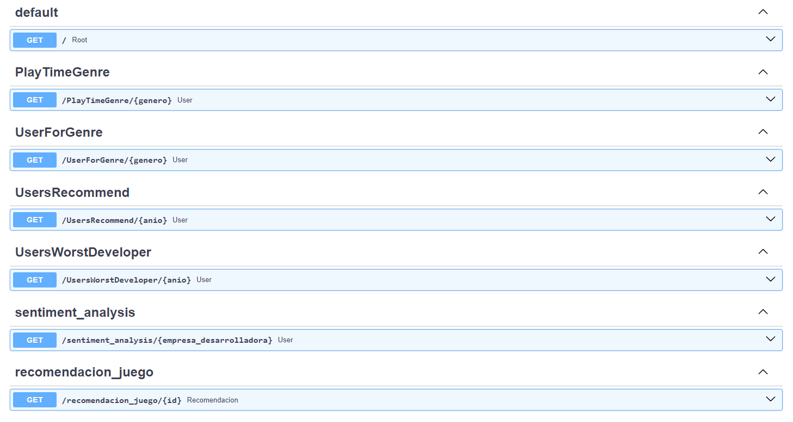